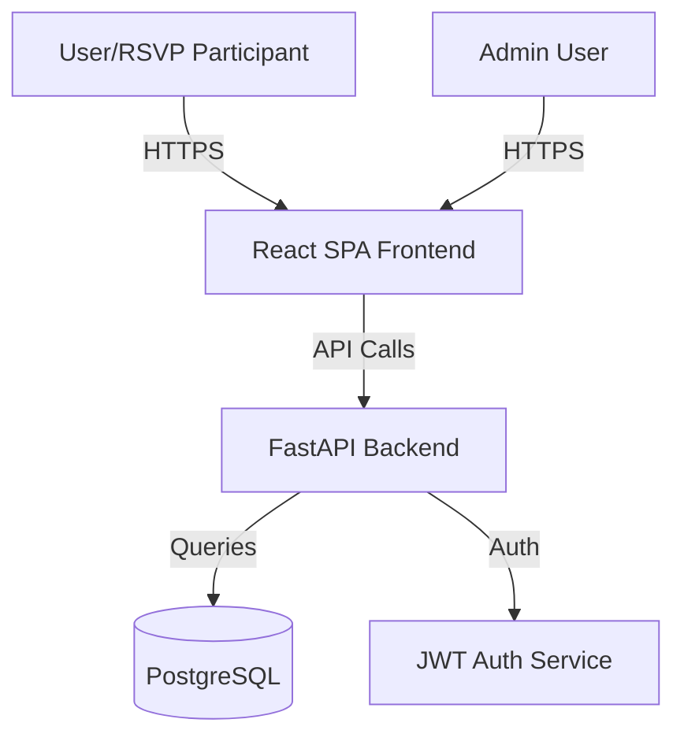

# Simple Invites - Implementation Plan

## Overview

A secure, minimal event RSVP and survey platform featuring one-question-per-screen UI, shareable invitation links, and multi-admin support.

## Architecture

**Scale Context**: Small-scale application where simplicity and maintainability are prioritized.

## Tech Stack

**Backend: Python + FastAPI**
- Strong security libraries (passlib, python-jose, cryptography)
- Automatic OpenAPI docs, validation, and async support
- SQLAlchemy ORM with Alembic migrations

**Frontend: React SPA**
- Smooth one-question-per-screen transitions
- Framer Motion for animations
- Tailwind CSS for styling

## Core Features

### Implemented

- ✅ Event Management with invitation tokens
- ✅ RSVP submission with identity, response, and optional contact info
- ✅ Survey system with multiple question types
- ✅ One-question-per-screen UI with smooth transitions
- ✅ Admin authentication with JWT
- ✅ Multi-admin support
- ✅ Access codes for protected events
- ✅ Email notifications for RSVP confirmations
- ✅ Passwordless RSVP editing via edit tokens
- ✅ Public guest list display option
- ✅ Configurable branding via APP_NAME

### Future Considerations

- Calendar integration
- CSV export functionality
- Multi-instance rate limiting (Redis)
- httpOnly cookie auth with CSRF protection

## Configuration

The application supports configurable branding:

- `APP_NAME`: Application name displayed in UI and emails
- `VITE_APP_NAME`: Frontend application name (build-time)
- `SMTP_FROM_NAME`: Email sender name (defaults to APP_NAME)

## Deployment

The core application is deployment-agnostic. It can be deployed to:
- Docker containers (any orchestrator)
- Cloud Run (GCP)
- AWS ECS/Fargate
- Kubernetes
- Any platform that supports Python and Node.js

See docs/ARCHITECTURE.md for detailed architecture documentation.
